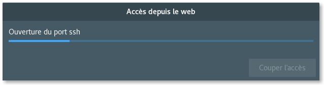
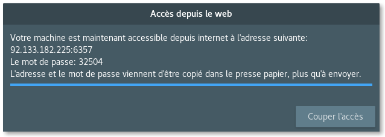

# let-me-do

Ce programme est là pour faciliter la vie des gens (et surtout la mienne) qui doivent faire de la maintenance, à distance, sur des postes sous Linux. Parce qu'on peut se dire qu'envoyer des commandes à copier coller dans un terminal ou même les dicter par téléphone c'est simple et rapide à faire. Mais pas du tout. Il y a toujours un problème et ce qui aurait du mettre 10 minutes (grand maximum) pour nous, prendra une heure avec un intermèdiaire lambda.

## Installation

Tu télécharges le [let-me-do.zip](https://github.com/L0L022/let-me-do/archive/master.zip), tu extrais le zip, tu ouvres un terminal dans le dossier où tu as extrais le zip (partie la plus ardue !) et tu fais un petit:

```bash
sudo bash install.bash install
```

Là ça risque de te poser des questions parce qu'il y a sûrement des programmes à installer, donc on dit oui et on attends.

Pour désinstaller:

```bash
sudo bash install.bash uninstall
```

## Lancement

L'application s'appelle ***Laisse moi faire !***, si le menu est rangé par catégorie elle doit être dans Internet.

Ou depuis un terminal:

```bash
let-me-do
```

Une fenêtre devrait s'ouvrir avec une barre de chargement:



Le **mot de passe administrateur** vous serra demandé. Ensuite il suffit d'attendre. Trop facile. Si tout se passe bien la fenêtre devrait ressembler à ça (les numéros changent):



## Qu'est ce que ça fait au juste ?

Le script va permettre à quelqu'un d'autre de se connecter à ton ordinateur depuis les internet. Pour ça il faudra lui donner ton **adresse ip** et le **mot de passe** atribué au hasard.

Une fois connecté il pourra faire absolument tout ce qu'il veut de l'ordinateur, car il aura les **droits administrateurs**. Il faut aussi noter qu'il pourra **voir l'écran** et **bouger la sourie**. En somme c'est comme si il était vraiment là.

## Comment on arrête ?

Très facile, il faut cliquer sur le gros bouton: Couper l'accès.

Si la personne auquel vous avez donné accés à l'ordi vous empèche d'appuyer sur le gros bouton essayez de:

- rabattre l'écran en espérant que l'ordi se mette en veille
- débrancher le routeur
- forcer l'arrêt, tout simplement (hannah's way)
